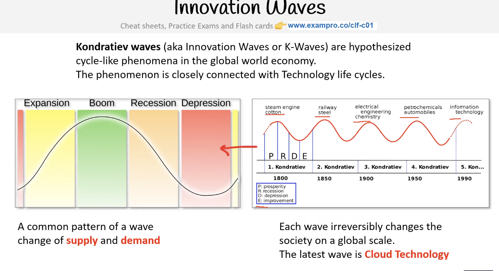
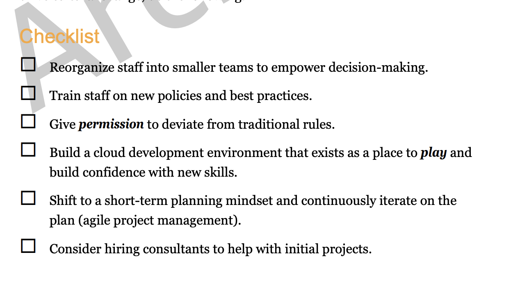
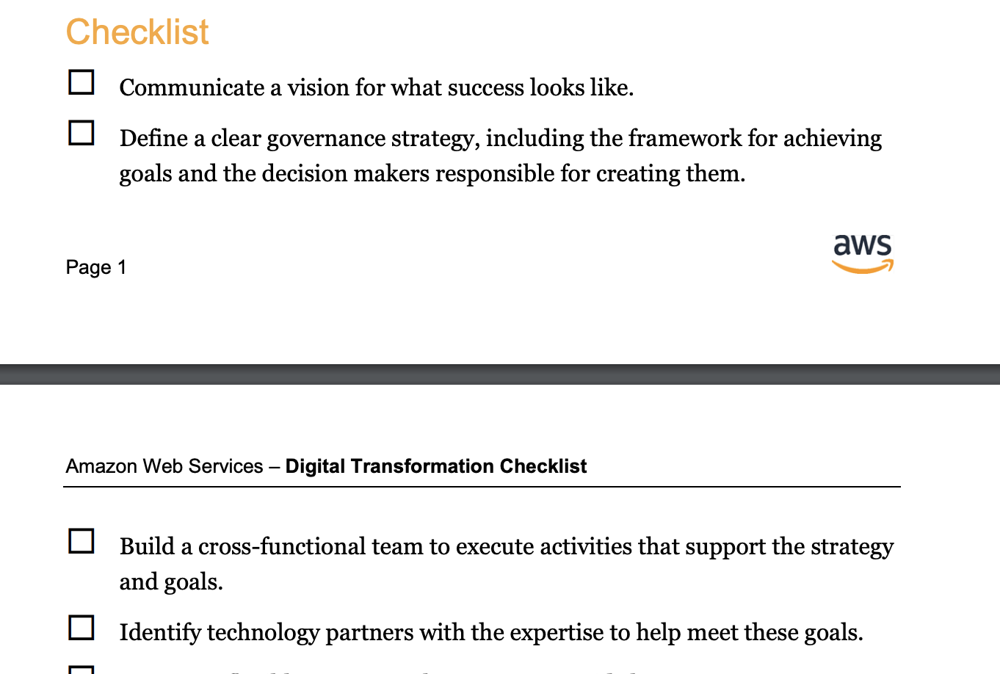
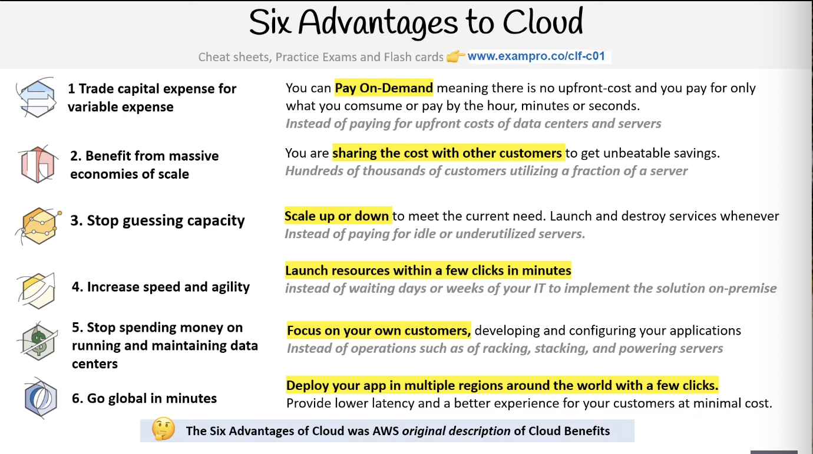
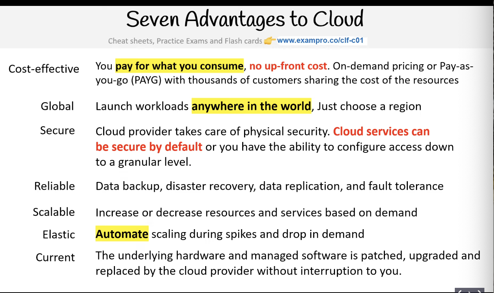
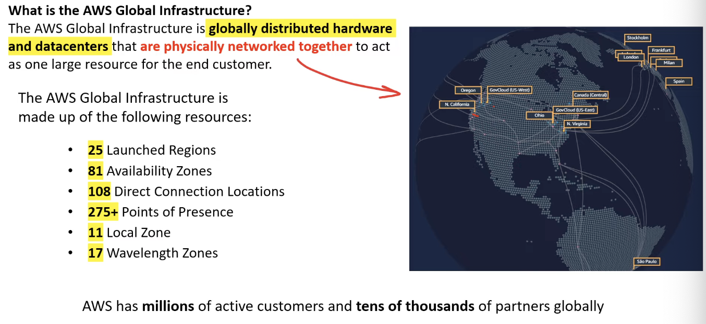
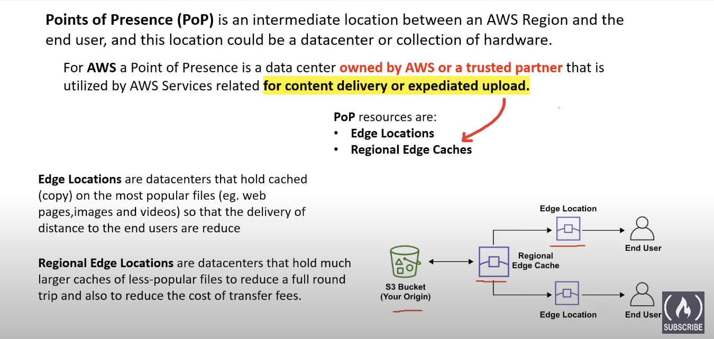
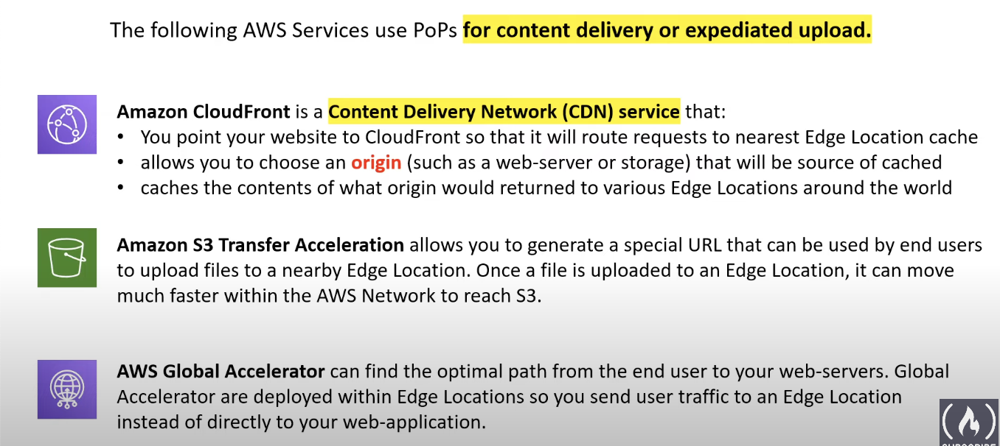
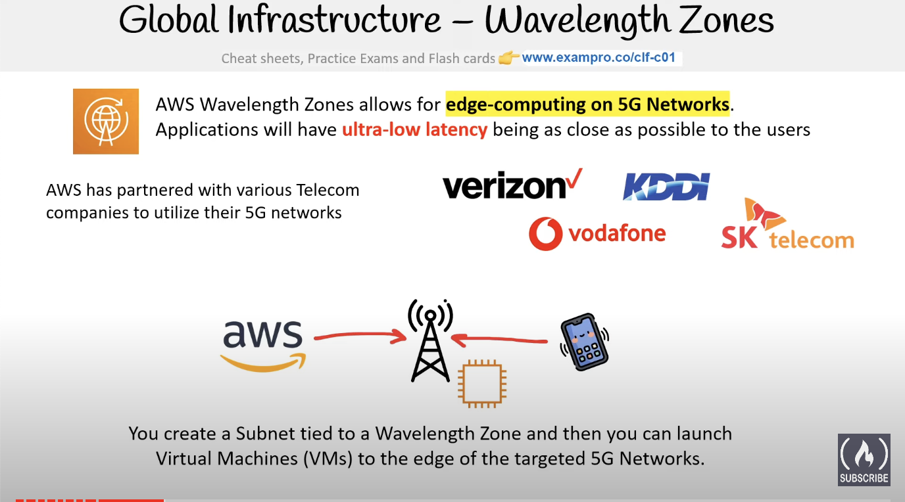
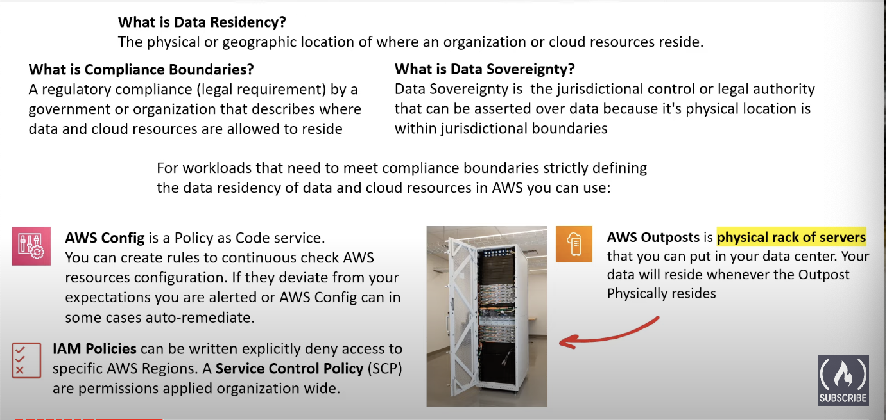

# What is Cloud Computing 

Practice of using a network of remote servers hosted on internet to store, manage, and proccess data, rather than a local server or personal computer. 

#### **Cloud hosting:** 

Multiple pysical machines that act as one system. The system is abstracted into multiple cloud services: **Flexible**, **scalable**, **secure**, **cost effective**, **high configuration**. 

# AWS

Amazon Web Service 

## Cloud Service provide(CSP) 

is company  that : 

* provides cloud services 
* cloud service that can be chained together to create cloud architectures
* cloud service are accessible via Single Unified API eg. AWS API 
* cloud service utilized metered billing based on usage. Eg : per second, per hour
* cloud sercvises have rich monitoring built in. Eg: AWS CloutTrail 
* cloud sercies have an infrastructure as a services (IaaS ) offering 
* Those cloud services offeres automation via infrastructure 
* 

**Note**:  If a company offers mulitiple cloud services under a single UI but do not meet most of or all of these requirements, it would be referrred to as a cloud platform e.g. Twilio, HashiCorp, Databricks. 

### LandScape of CSPs

**Tier 1** : Top tier: Early to market, wide offering, string synergies between services, well recognized :   AWS, Azure, google cloud Platform, Alibaba cloud 

**Tier 2**: Backed by well known tech companies, slow to innovate to spaciliation 

IBM cloud, Oracle cloud, rackspace

**Tier 3:** Light tier : Virtural provate Services(VPS). Ex: Vulture, Digital Ocean, Linode 

### Common cloud Sercies

Cloud service provide that are infrastructure as a service will always have **4 core cloud service offerings:** 

1. compute : Virtual machines
2. Networking : Private cloud networking 

3. Storage: virtural hard drives
4. DataBase : SQL data bases 

### Evolution of Computing 

#### Dedicated 

* a single machine whholly utilized by single customer
* guarantee of security, privacy, and fully utility
* You are limited by your host operating system 

#### VMs

* run multiple virtual machine on one machine 
* you will underutilized virtual machine
* Easy to export and import images for migration 
* easy to vertical or hiorizontal scale 

#### Containers

* virtual machine eunninf containers 
* Docker Deamone: is the name of the software layer that lets you run multiple containers
* You can maximize the utilize of the available capacity whihc is more cost effective 
* a lot more work to maintain 

#### Functions

* are managed by VM managed containers
* KNnow as serverless computer 
* you upload your code and choose amount of duration 
* cost effective. Only pay for the time code is running. VMs only run when there is code to be executed 
* cold starts is a side effect of this setup 

###  Types of cloud computing 

represented as pyramid

Saas: designed for **customers** in mind

PaaS: Platform as a service: inted for **developers** 

IaaS: infrastructrure as service: basic buildingn for IT. Don't worry about IT stuffs, hardware. Designed for **administrators** 

### Cloud Computing Deployment Models

#### **Public cloud**

 Work load, code is bbuid on cloud provider. Cloud Native or cloud first 

#### **Private cloud**: 

Everything build on company data centers. Open stack 

#### **Hyprid**: 

Using both onpremise and a cloud service provider 

#### Cross Cloud 

Using multiple cloud providers. AKA multiloud. EX: Anthos. Amazon EKS. 

### Deployment Models

cloud 

hybrid

On Premise 

### **Innovation wave**

### Burning Platform 

Burning platform is a term used when a company abandoms old technology for new technology with the uncertainty of success and can be motivated by fear that the organization future survival hinges on its digital transoformatino. 

Example: 

1.  a company switching from cloud to web 3 
2. a company abandoning on premises and start using cloud 

### **Digital transformation** 

**NOTE**: read these checklist if you are in administration and you need a change in your company and you need some convicing keyPoints

Computing power

General computing

GPU computing 

Quantum computing: 100 millioin times faster 

AWS Service offering: 

* Elastic Computer clpoud EC2 

* AWS ingerentiate (inf1)
* AWS bracket: via calTech 

**AMAZON bracket** : using Quantum computing on AWS. It is accessible 

### **Benefits of Cloud** 

The benefits of the cloud is a summary of reasons why an organization would consinder adopting or migrating to utilizing public cloud 

1. Agility
   * Increase speed and agility 
2. Pay as you go pricing 
   * Trade Capital expense for variable expense
3. Econonmy of scale
   * Benefit from massive economies of scale
4. Global reach 
   * Go global in minutes 
5. Security 
6. Reliability 
   * Stop spending money on runnin and maitaining data centers 
7. High availability 
8. Scalability 
   * Benefit from massie economies of scale
9. Elasticity 

### **Six Advantages to cloud** computing 

part of AWS documentation 

### Seven Advantages to cloud 

## **AWS Global infrastructure** 

 

Us east-1 is the main one in Virginia

Availability Zone(**AZ**) is a pysical loaction made up of one or more data center 

generallly contains 3 availability zones 

**The US-EAST-1 region has 6 AZs( the most availability Zones of any region)**

### **Fault Tolerance**

A fault domain is a section of a network that is vulnerable to damage if a critical device of system fails. **The Purpose of fault domains** is that if a failure occurs it will not cascade outside that domain, limiting the damage possible. 

You can have fault domains nested inside fault domains 

#### **What is a fault level?**

A fault level is a collection of fault domains 

### **AWS Global Network** 

BackBone of AWS 

### **Point of Presence (POP)**

## AWS Direct Connect

AWS direct connect It is **a private/dedicated** connection between your data center, office, co-location and AWS. 

Direct Connect has two very fast Network connecion options 

1. Lower Bandwidth 50MBps - 500MBps
2. Higher Bandwidth 1GBps or 10GBps 

Importance 

* helps reduce network costs and increase bandwidth throughput. (great for high traffic networks)
* Provides a more consistent network experience than typical internet based connection. (Reliable and secure)

### **Direct connect Location** 

Are trusted partenered data centers that you can establish a dedicated high speed, low latency connection from your on-premise to AWS

### AWS local zones 

Are data centers located very close to a densely populated area to provide single digit miliseconf low latency perfomance. 

The purpose of local zones is the support highly demanding applications sensitive to latencies 

* medica & entertainment 

* Electronic Design Automation 

* Ad -tecg 

* machine learning 

  **Example of local zone is Los Angeles, california the first local zone to be deployed**

  you need to opt in to use local zone

  

### Data Residency 

A physical or geographical location of where an organization or cloud resources reside 

