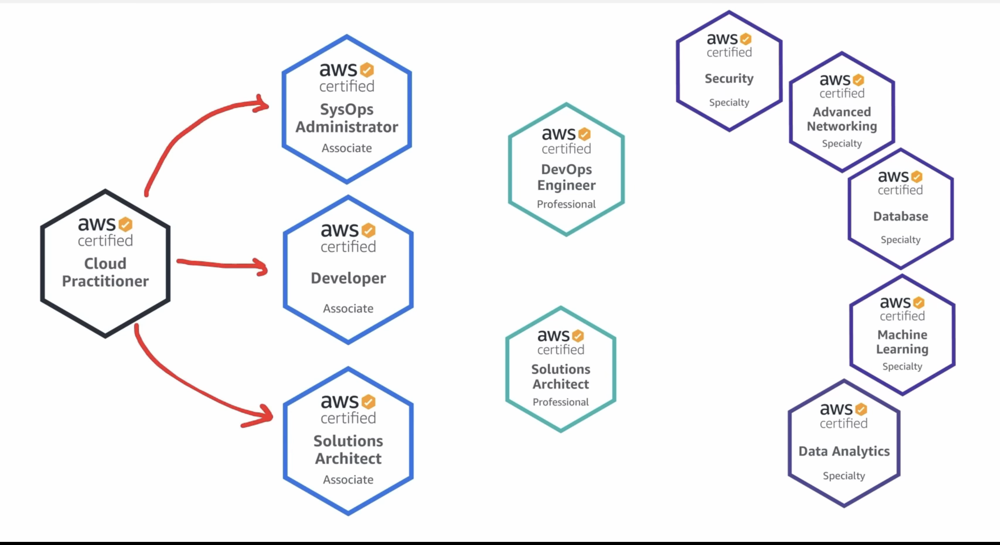
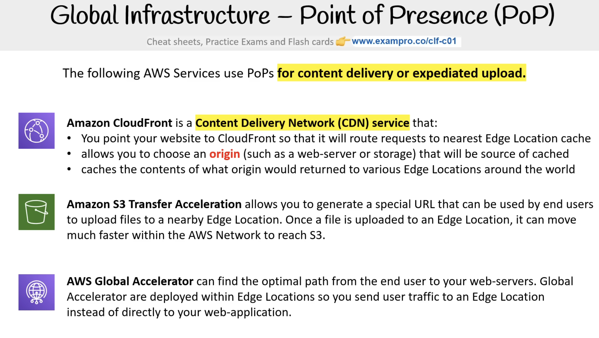
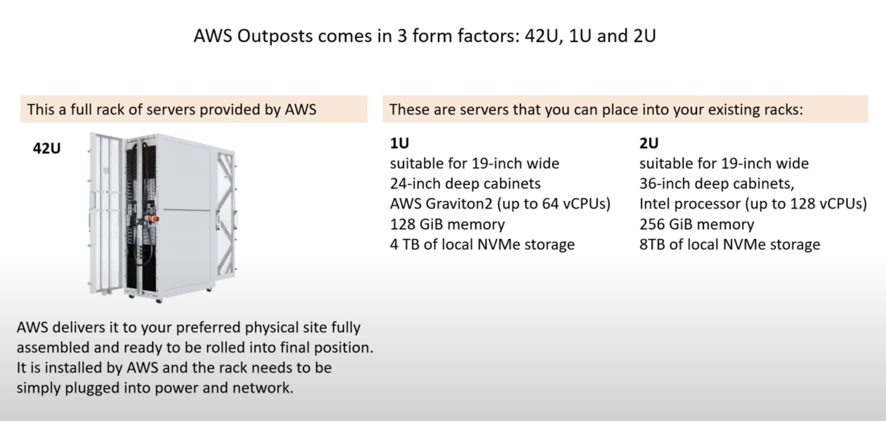
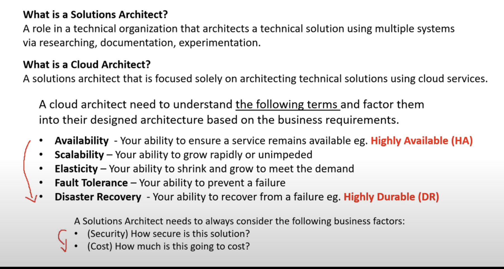
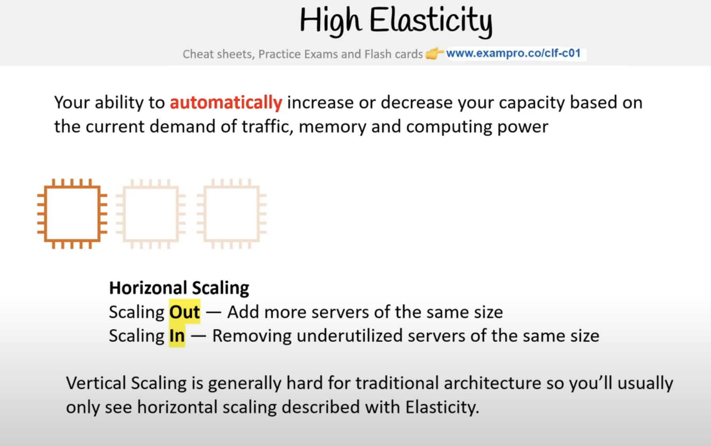
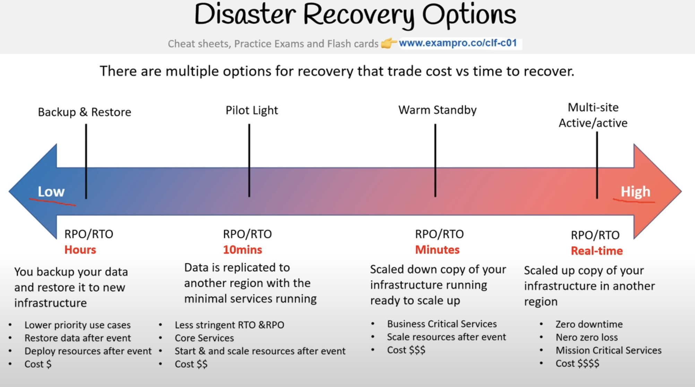
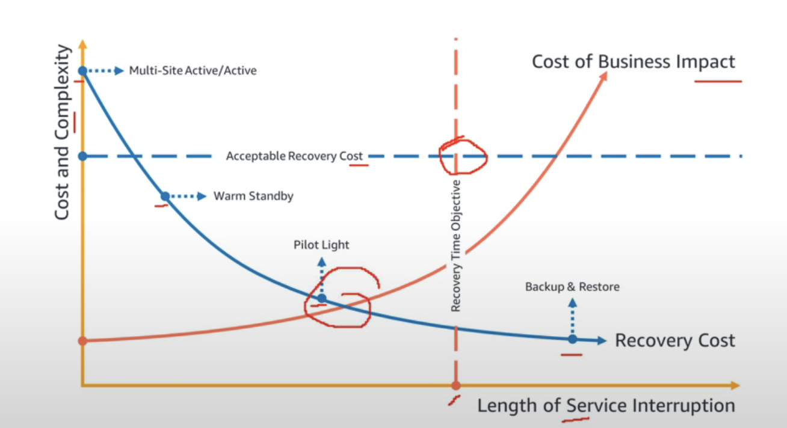
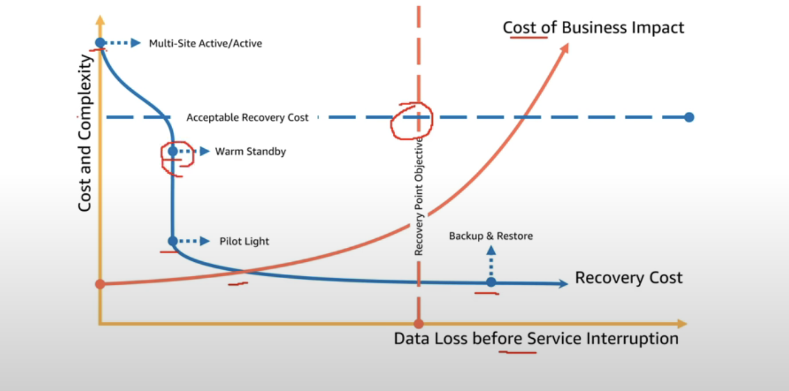
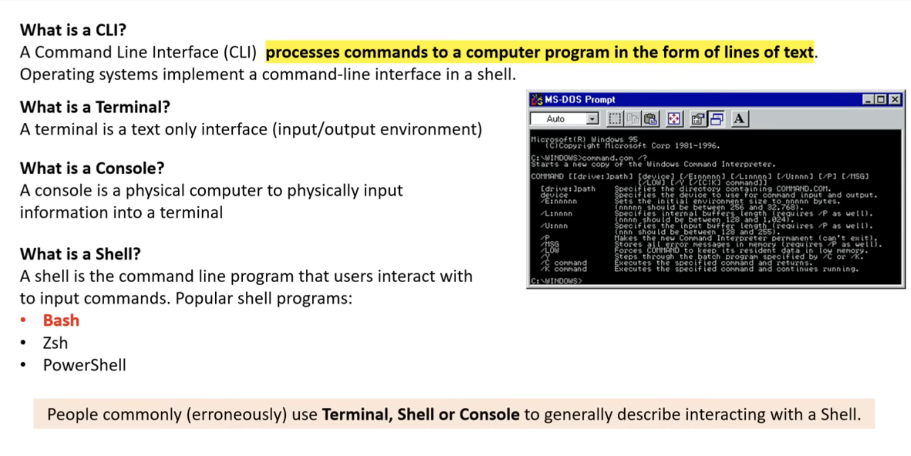
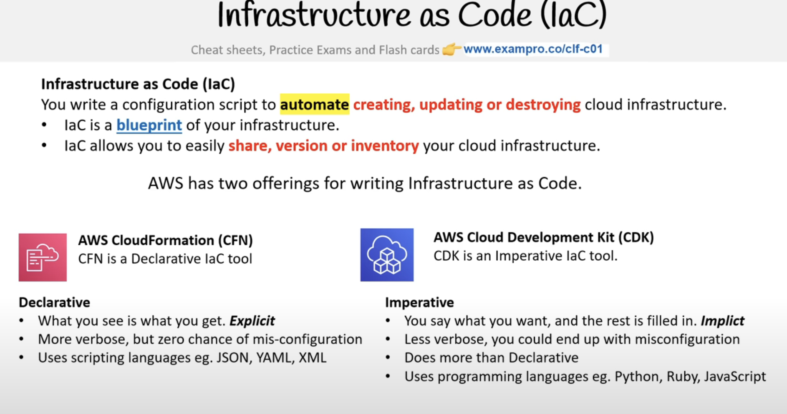

# AWS_Certified Cloud Practitioner


## RoadMap to get AWS certified





## The Exam has 4 Domains

1. 26 % **Domain** 1 1: Cloud concepts (13 questions)

2. 25% **Domain**2: Security and compliance ( 16 - 17 questions)

3. 33% **Domain** 3: Technology  (21- 22 questions)

4. 16% **Domain**4: Billing and pricing  (10 - 11 questions)

   

   **Passing 700/1000**

   

   Cloud service: a collection of servers in a network to store and manage data. 

   

   ## AWS Evolution. 

   * Simple Queue Services (SQS)  launched in 2004
   * Simple Storage Services (S3) launched in 2006
   * Elastic Compute cloud (EC2) launched in August 2006 

   

   ## Common Cloud Services

   * **Compute** ( like a virutal computer that runs all application and program and code)

   * **Networking** (virtual network definint internet connection or network isolations between services or outbound to the internet)

   * **Storage** ( virtual hard drive that can stores files)

   * **Databases** virtual databases or database for general purpose web application)

     AWS has over 200+ cloud services 

     

   ## Evolution of Computing

   * Dedicated
     * Dedicated machine for your services
     * You have to know the space you will need upfront
   * VMS : 
     * Run multiple virtual machine on one machine
     * Most common
   * Container
     * More flexible
     * Lots of work to maintain
     * Example :  Docker
   * Functions:
     * Managed by VMS runnning managed Containers
     * Serveless computer
     * pay for the time the code is running
     * Cold Starts is  side effect

   

   ## Types of Cloud Computing 

   * SaaS
   * PaaS
   * IaaS 

   


## Cloud Computing Deployment Models

* Public Cloud: Everything is build on the cloud service provider(CSP) 

* Private Cloud : Everything is built on company's datacenter also know as **OnPremise**. The cloud can be open stack

* Hybrid : Using both OnPremise and a Cloud Sevice provider(CSV). 

* Cross Cloud : Using multiple Service provide. AKA multi cloud 

  ​	


## Innovation Waves

Kondratiev waves: are hypothesized cycle-like phenomena in the global world of economy. The phenomena is closely connected with Technology.

## Burning Platform

 Refers to when a company abandoms old technology for new technology with the uncertainity of success and can be motivated by fear that organization future survival hinges on its digital platform. Example: Switchich from On-Premises to cloud services. 


## Digital Transformation Checklist

[Checklist](chrome-extension://efaidnbmnnnibpcajpcglclefindmkaj/https://d1.awsstatic.com/whitepapers/digital-transformation-checklist.pdf)

## Evolution of computing Power

Computing power is a throughput measured at which a computer can complete a computation task. 

* CPU 

* GPU

* Quantum computing. 

  

  ### AWS Service offerering 

  * CPU => Elastic Compute Cloid EC2
  * GPU = > AWS inferentiare (InF1)
  * Quantum computing => AWS Bracket. 


## Benefits of Cloud 

* Agility : Increase speed and agility 
* Pay as you go pricing
* Economy of scale: Benefits from massive economies of scale
* Global Reach
* Security
* Reliablity
* High Availability
* Scalability : Benefits from massive economies of scale
* Elasticity 

## Six Advantages to Cloud ( original description )

1. Trade fixed expense for variable expense
2. Benefit from massive economies of scale 
3. Stop guessing capacity 
4. Increase speed and agility 
5. Stop spending money running and maintaining data centers
6. Go global in minutes 


[Six Advantages to Cloud](https://docs.aws.amazon.com/whitepapers/latest/aws-overview/six-advantages-of-cloud-computing.html)


## The seven Advantages to cloud 

* Cost Effective

* Global 
* Secure
* Reliable
* Scalable
* Elastic : Automate
* Currrent


## AWS Global Infrastructure

AWS global infrastructure is a global distributed **hardware** and **datacenter** that **are physically networked together** to act as one large resources for end customer.

### Region

A region is a geographical disticnct locations consiting of 	one or more availability zones. 	Every region is pyhysically isolated from independet of every other region in terms of location, power, water and supply. 

The first aws region to be created is in Nothern 	Virginia(US-East1)

Each region has **3 availabilty zones.**

AWS prices vary by region

### 4 Factors to consinder when choosing a region 

1. What regulatory compliance does the region meet?
2. What is the cost of AWS services in this region?
3. what AWS Services are available in this region?
4. What is the distance  or latency to my end users?

## Region vs Global Services

**Region**: AWS scopes. This detemine where the AWS sercices will be launched. 

**Global**: SOme AWS services operate across mutliple region an will be fixed to global. Example : Cloud front., Amazon S3, ...


## Availibity Zones (AZ)

Refers to physical location made up of one or more datacenters. 

A datacenter is a secured building that contains hundreds and thousands of computers. 

A region will generally contain **3 available zones.** 

It is common practbie to run workloads at least in 3 AZ to ensure services reamin available in case one or two datacenter fail (High availability). 

A subset is associated with availabity zine.

Alll traffic between Az is encrypted

Azs are within 60miles of each other. 


## Fault Tolerance

 A fault domain is a section of a network that is vurneravle to damage if a critical device or system fails. The purpose of a fault domain is that if a failure occurs it will not cascade outside that domain., limit the damage possible. 

What is a fault level?
a fault level is a collection of fault domains. 

* AWS region would be a fault level
* AZ would be fault domain. 


Each amazon region is designed to be completely isolated from the other amazon regions. This achieves the greates possible fault tolerance and stability. 


Each Az is isolated but Az within the region are connected through low latency links. 


### AWS Global NEtwork 

Represents interconnection between AWS global infrastructure. Common referred to as **"Back Bone of AWS"** 

### Point of Presence (PoP)

Pop is na intermediate location betwen an AWS region and the end user and this location could be datacenter or collection of Hardware. 

### Pop resources are:

* **Edge locations** : data centers that hold cached (copy) on the most popular files(images, videos, web). So that the delively to end users is short. 

* **Regional Edge Caches** : data centers that hold much larger caches of less popular files to reduce a full round trip and also to reduce the cost of transfer fee.

  



## AWS Direct Connect

AWS Direct connection is a private/dedicated connection between your datacenter, office, co location and AWS. 

Direct Connect has two very fast network:

1. Lower BandWidth 50MBPs- 500MBps
2. Higher BandWidth 1GBps or 10 GBps

### **Advantage** of Direct connect

:+1:   Helps reduce network costs and increase bandwodth throughput (great for high traffic networks)

:+1:  Provides a more consistent network experience than a typical internet based connection. ( reliable and secure)

## Direct Connect location 

Direct connect locations **are trusted partnered datacenters** that you can establish a dedicated high speed, low latency connection from your on-premise to AWS.

## Local Zones

LOcal zones are datacenter located very close to a densely populated area to provide single millisecond low latency performance(eg. 7ms) fo that area. Exa: Los Angeles, California.

​	 :white_check_mark: The purpose of local zone is to support highly demanding applications sensitive to latency. 

Ex: 

 	1.  media and entertainment. 
 	2.  Ad -tech
 	3.  Machine leaning

## Wavelength zones. 

AWS wavelength zones allows for the **edge computng on 5G** **networks**. Application will have ultra low latency being as close as possible to users. 

How is done? => You create a subnet tied to a wavelength zone and then you can launch virtual machnines (VMs) to the edge of the targeted 5G networks.


## Data Residency

Phyisical or geographyical location of where an organization or cloud resources reside. 

**What is compliance boundary?** = > a regulatory compliance by the organization that describes where data resides. 

**What Data Sovereignty?** => legal authority that can be asserted over data because it is physical location is within jurisdictional boundaries. 


## GOV Cloud

**FedRamp** stands for **F**ederal **R**isk and **A**uthorization **M**anagement **P**rogram. A US government wide program that provides a standarized approache to security assessment authorization and continous monitoring for cloud products and services. 

**GovCloud:** A cloud service provider generally offer an isolated region to run FedRam Workloads. 

**AWS GovCloud Regions** allows customers to host sensitvie controlled Unclassified information and other types of regulated workloads. 


## AWS in china

AWS cloud offering in mainlad china.

It is isolated intentioally from AWS Global to meet regulatory compliance of mainland china. 

AWS china has its own comain at `amazonaws.com`

In order to operate AWS in china, you need to have a Chiness Business License ( ICP licence).

AWS has two regions in Mainland China. 

* Ningxia Region
* Beijing Region 


## Sustainability

* Renewable Enerygy. Achieve it by  2025
* Cloud Effeciency 
* Water Stewardship ( evaporative technology to cool down the data center)


## AWS Ground Station

Lets you control satellite communications, process data, and scale your operations without having to worry abput builing onr managing your own ground statin infrastructure. 


Used in cases like:

* Weather forecasting
* Surface imaging
* Communications
* Video broadcasts


use the AWS ground station EC2 AMI to launch EC2 instances that will uplink and downlink data during the contact or receive downlinked data in an amazon S3 bucket. 


## AWS Outposts

Rack of servers running AWS infrastructure on your physical location. 

Server Rack: Is a frame designed to hold and organize IT equipment. 

AWS Ouputs comes in 3 form factors 

* 42U
* 1U
* 2U




## Cloud Architecture Terminologies 




### High availability

Your ability for your service **to remain available** by ensuring there is no single point of failure and ensure/a certain level of perfomence. 

* Elastic Load Balancer: load traffic to one or more datacenter. If a datacenter or server becomes unavailable the load balace will route the traffic to only available datacenters with servers.

### High Scalability

**Ability to increase capacity based on the increase of demand o**f traffic, memory and computing power. 

2 ways to accomplish this

* veritical scalling / scalling up. Upgrading to a bigger server
* Horizontal scaling : scalling out, adding more servers of the same size. 

### High Elasticity

Ability to automatically increase or decrease your capacity based on the current demand of traffic, memory and computig power. 

* Horizontatl Scalling. 

* Use Auto Scalling Groups (ASG) : this feature will automatically add or remove serves based on scaling rules you define based on metrics. 

  

  

### High Fault Tolerance

Ability for your service to ensure there is no sinlge point of failure. Preventing the chance of failure. 

Example: having a copy( or secondary) of your database where all ongoing changes are synced. The secondaty system is not in use until a fail pver occurs and it becomes the primary database.

### High Distaster Recovery 

Ability to recover from a disaster and to prevent the loss of data solutions that recover from a disaster in known as Disaster Recovery (DR)

=> **CloudEndure Disaster Recovery :** Continually repricates your machine into low cost staging area in your target AWS account and preferred Region enabling fast and reliable recovery in case of IT data center failures. 

## Business Continuall Plan (BCP)

​	A BCP is a document that outlines how a business will continue operating during an unplanned disruption in services. 

* **RPO ( Recovery POint Objective) :** The max acceptable amount of data loss after an unplanned disaster**. How much data are you willing to loose.** 
* **RTO(Revery Rime Objective)** : The maximum amount of downtime your business can tolerate without incurring a significant financial loss. > **How much time are you willing to go down.** 


## Disaster Recovery Options




## RTO visualized

Recovery Time Objective (RTO)

The maximum acceptable delay between the interruption of service and restoration of service. This objective determines what is considered an acceptable time window when service is unavailable and is defined by the organization. 




## RPO Visualized

Recovery Point Objective : The maximum acceptable amount of time since the last data recovery Point. THis objective determines what is considered an acceptable loss of data between the last recovery point and the interruprion of service and is defined by the organization.





## Managment and Development tools. 


### AWS API

API Application Programming Interface. Applicatin that allows two application or services to tak to each other. 

### AWS Tools for PowerShell

Task automation and configuration management framework. 

* Use Bash 

* or PoweShell

* AWS has all these pre installed. you can type 

  ```
  bash // to use  bash
  pwsh // for power shell
  ```

  

  

### ARNs : Amazon Resources names. 

Uniquely identify AWS resources. 

### AWS CLI (command line interface)



AWS CLI allows users to programmatically interact with the AWS API via entering single or multi line commands into a shell or terminal. 


The commands are online CLI commands. 

### AWS SDK

SDK is a collection of software development tools in one installable package. 

AWS SDK is offered n various language: 

* Java,
* Python
* C/C++
* Ruby

AWS Cloud Shell: 

Browser based shell. 

contains AWS CLI, python, java, etc..


### Infrastructure as Code (Iac)

Automate, creating, and updating or destroying



### Cloud Formation 


### AWS CDK

AWS CDK allows you to use these language

* typeSript

* Node.Js
* Python
* Java
* ASP.Net

Cloud COnframtion has its won CLI

Notes: 

* VSCODE has AWS toolkit you can use

## Access Keys


